## 1. Windows系统安装WSL 2
这是Docker Desktop推荐的安装方式
https://learn.microsoft.com/en-us/windows/wsl/install
```shell
## 安装wsl
wsl --install
## 查看可安装的Linux发行版
wsl --list --online
## 安装Ubuntu
wsl --install Ubuntu
## 验证运行的发布版
wsl -l -v
```
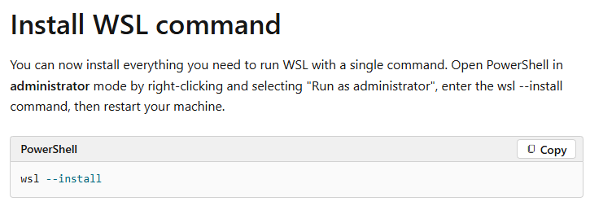
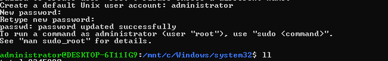
administrator/root

## 2. Windows系统安装Docker Desktop
https://docs.docker.com/desktop/features/wsl/

### 2.1 安装Docker Desktop
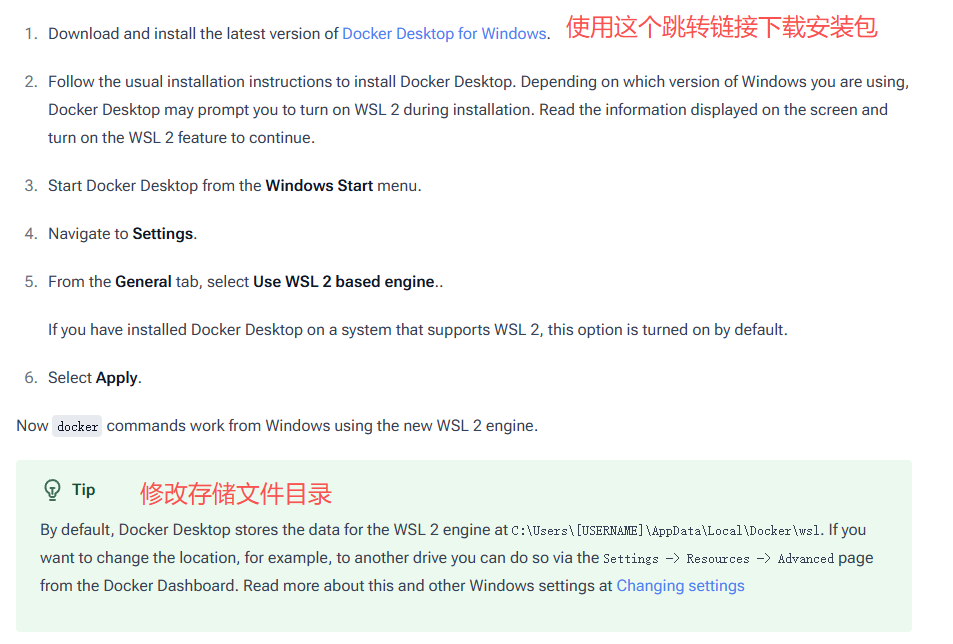
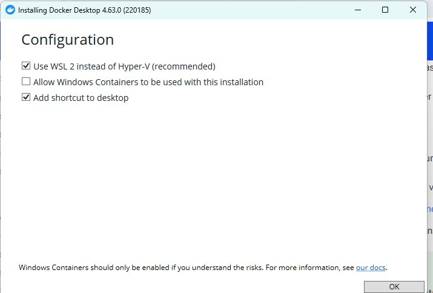

### 2.2 注册Docker Desktop账号
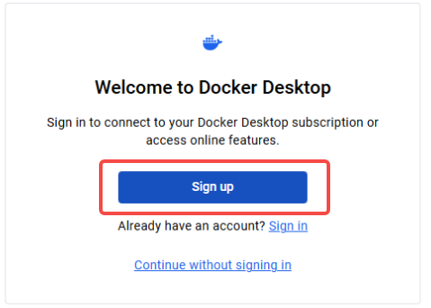
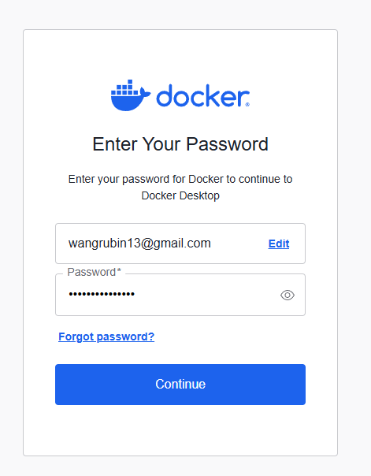

### 2.3 设置Docker Desktop
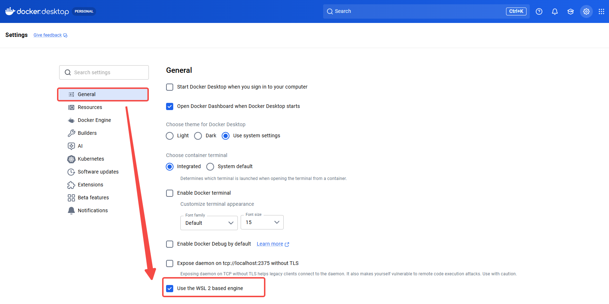
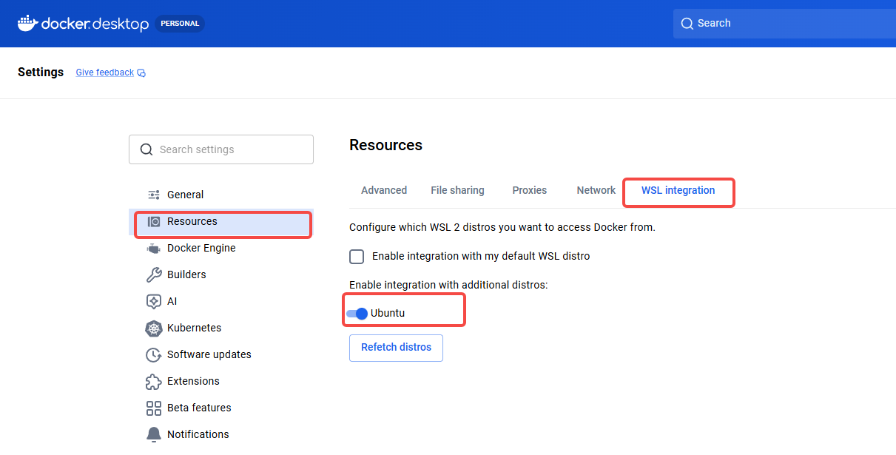
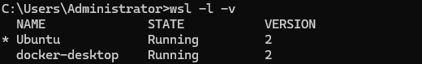
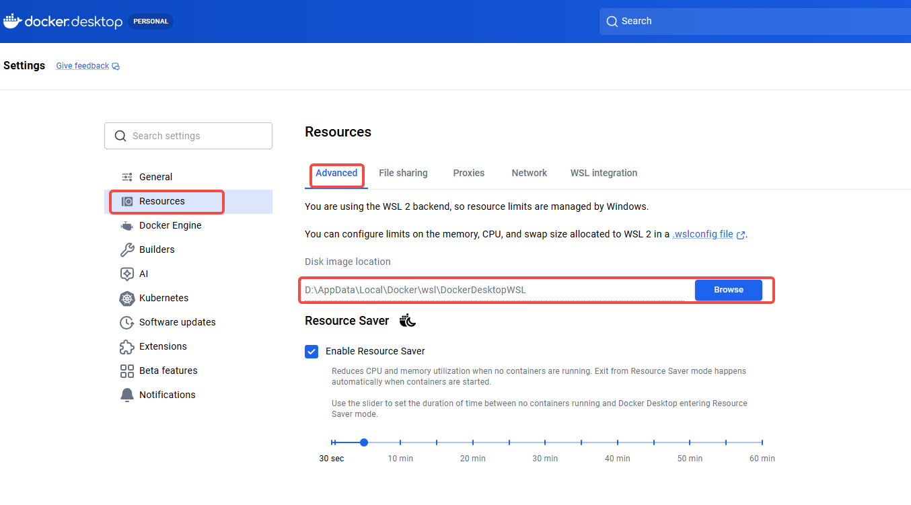

## 3. 拷贝开发环境Devops项目
### 3.1. 克隆仓库
```shell
git clone https://github.com/1085904057/devops-local-env.git
cd devops-local-env
```
### 3.2. 启动容器
```shell
# 给脚本添加执行权限（Linux/Mac）
chmod +x ./scripts/start.sh ./scripts/stop.sh

# Linux用户
./scripts/start.sh

# Windows用户
.\scripts\start.ps1
```
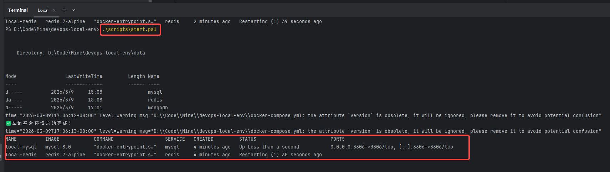

## 4. 运行服务并验证
```shell
# 查看所有服务状态
docker-compose ps

# 查看MySQL日志
docker logs local-mysql

# 连接测试（以MySQL为例）
mysql -h 127.0.0.1 -P 3306 -u root -p123456
```